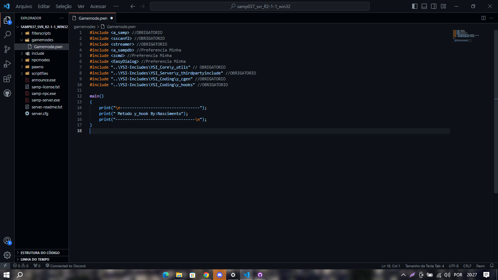
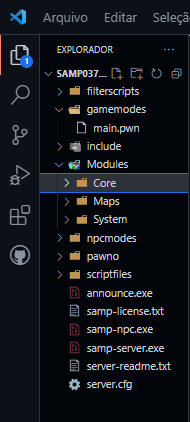

# Manipulacao Dos Modulos


Abra a Gamemode no Visual Studio Code e Iremos apagar TODA a Gamemode.


Sim, Deixaremos Apenas as Includes 

```c
#include <a_samp> //OBRIGATORIO
#include <sscanf2> //OBRIGATORIO
#include <streamer> //OBRIGATORIO
#include <a_sampdb> //Preferencia Minha
#include <zcmd> //Preferencia Minha [use seu procesador de comando de preferencia]
#include <EasyDialog> //Preferencia Minha
#include "..\YSI-Includes\YSI_Core\y_utils" // OBRIGATORIO
#include "..\YSI-Includes\YSI_Server\y_thirdpartyinclude" //OBRIGATORIO
#include "..\YSI-Includes\YSI_Coding\y_cgen" //OBRIGATORIO
#include "..\YSI-Includes\YSI_Coding\y_hooks" //OBRIGATORIO
```

# Modulo Principal

Apos Iniciamos o Modulo Principal Vamos Renomealo para `main.pwn` Para Ser Mais Facil e Organizado, Apos Isso Vamos Criar Os Modulos.


Percebam que criei as pastas
```c
[Modules] //Principal, Aqui Vamos Guarda Nossos Modulos
[Modules/Core] //Core Nucleo Da Nossa Gamemode Aqui Estarao Noosos Codigos Internos(Variaveis) (Stocks) (Macros) (Defines)

[Modules/Maps] // Como Proprio Nome Ja Diz Nossos Mapas (Banco) (Spawn) (Loja1) (Prefeitura)

[Modules/System] //Aqui Estara Nossos Sistemas (Login) (Inventario) (Rodape) (Velocimetro)
```

Aqui e o Meu Tipo de Modulacao cada Arquivo na sua Pasta, Voce Pode Criar Como Quiser Mais Lembre-se a quandos chamamos os Modulos na Gamemode Principal Temos que Observar a Hierarquia Dos Modulos.

Vamos a Proxima Aula;

[Hierarquia Dos Modulos](../Aulas/curso2.md)