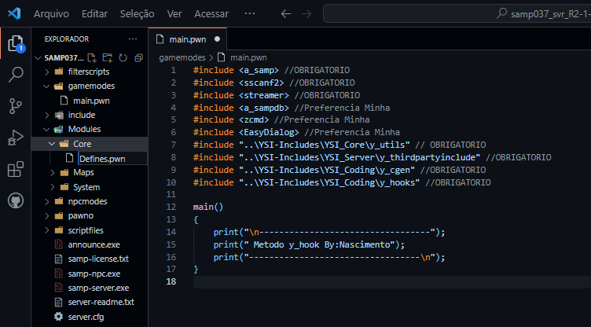
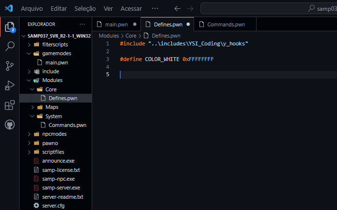
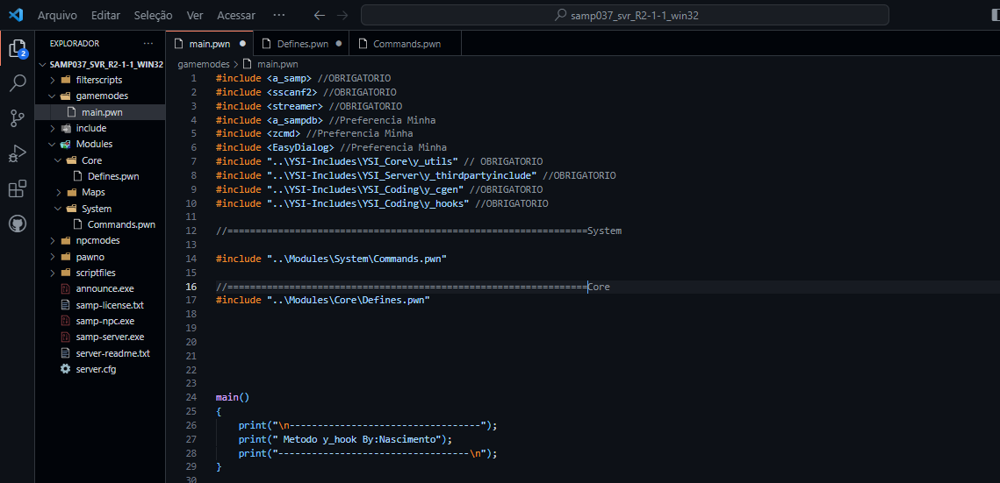
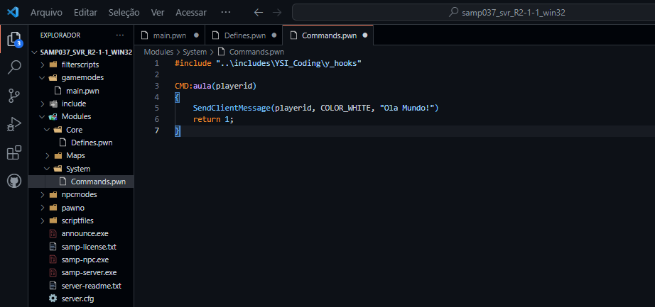
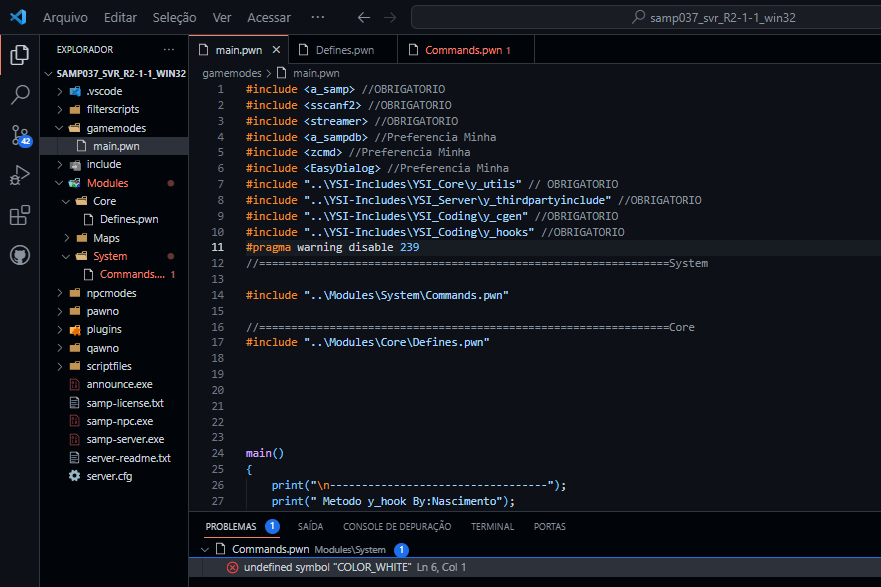
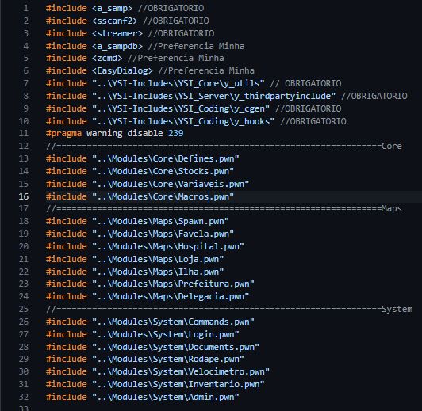
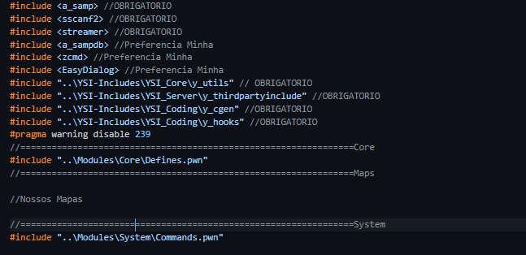

# Hierarquia Dos Módulos

Assim Como na Gamemode Normal nos Módulos a Hierarquia também Funciona, oque e a Hierarquia dos Módulos e Simples, Nos Temos
```c
Stocks
Variáveis
Macros
Defines
```

Esse Exemplo;
Vamos criar o Modulo 
Defines.pwn (pra quem usa Vscode Sempre bom colocar .pwn para as extensões auxiliares e auto-completes Funcionarem.)
Caso não use Vscode/SublimeText você pode definir o Tipo do Arquivo como quiser, (pwn, inc, txt, pogba, Brasil, etc...) Tanto faz o Tipo de Arquivo, (recomendo .pwn)

Bom Vamos ao Módulo
Modules/Core/Defines.pwn


Vamos Criar mais um Modulo, Digamos que você irá começar seu Modulo De Comandos. Por tanto vamos Criar em System o Módulo Commands.pwn
```c
Modules/System/Commands.pwn
```

Agora vamos adicionar ao nossos Módulos 
```c
#include "..\YSI-Includes\YSI_Coding\y_hooks" //OBRIGATORIO
```

Em ambos os módulos na linha 1 devemos ter esse Código, que Estamos solicitando as Includes Necessárias pra Modulação na Biblioteca da YSI_Includes, Todos Os Seus Modulos Deve Ter Esse Codigo na Primeira Linha!

# Hierarquia na Prática.

No Módulo Defines Vamos Adicionar
```c
#define COLOR_WHITE 0xFFFFFFFF
```
Vamos Ver o erro da Hierarquia Na Pratica, o Modulo Defines vai ficar assim


Agora Vamos na Gamemode Principal e Vamos Adiciona nossos Modulos Como Includes


Perceberam o Erro? Nao? Vou Te Mostrar! Vamos Continuar Vamos Criar Um Comando Simples no nosso Modulo Commands.pwn


Ainda Nao Perceberam? Vamos Compilar! Sempre Devemos Compilar a main.pwn se nao os Modulos dao erros, portanto sempre compile a main.pwn (Gamemode Principal)


Pronto! Temos um erro de Hierarquia de Módulos, Nos Adicionamos a Definição Para a Coloração da Mensagem, e mesmo assim não o Compilador não Reconheceu nossa Define, Por que? Simples! Eu Chamei o Comando Primeiro que a Definição, Como assim? O Pawncc(Compilador) Ele ler de Cima Para Baixo, e nos Chamamos o Módulo `"Commands.pwn"` Primeiro que as Definições(Em Nosso Caso a Coloração) dele Agora Vamos imaginar os Módulos, Login.pwn, Commands.pwn, Admins.pwn, Inventário.pwn todos esses Módulos Teriam Defines, Variáveis, Stocks, Macros, que não seriam Chamados Primeiro que eles Por tanto daria Muitos e Muitos erros de Falta de Definição Pois o Pawncc não iria Reconhecer essas Variáveis, Defines, etc...

# Como Fazer Hierarquia da Maneira Certa

Para fazer a Hierarquia da Maneira Certa, Devemos Sempre! Colocar Nossas Stocks, Defines, Variáveis, sendo Chamadas em primeiro na Nossa Gamemode principal.

Um Exemplo de uma Gamemode que já estaria em um Estágio Avançado.


Lindo Nao? Organizado Limpo, Entenderam? Como Funciona a Hierarquia? Bom Vamos Voltar a Nossa Gamemode, Vamos tirar o erro dela de uma Forma bem Simples, Vamos trocar a Ordem da Chamada dos Módulos! Veja abaixo.


Sim Muito Simples!.
# Importante!

Devemos Adicionar a nossa Gamemode Principal a pragma 239 Algumas Includes nao se comportam muito bem com a modulacao por tanto dao essa warning mais podemos resolver apenas usando esse codigo, Caso nenhuma das suas includes deem esse warning nao e necessario!

```c
#pragma warning disable 239
```

Vamos Para Proxima Aula
[Manipulacao De Callbacks](../Aulas/curso3.md)