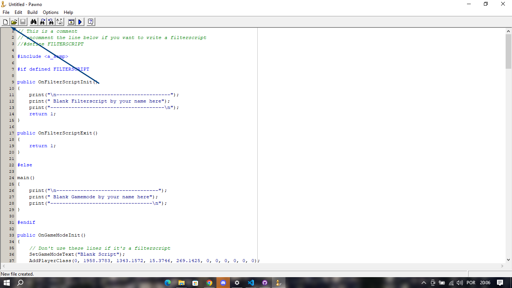

# Introducao

O metodo y_hook Introducao

# Arquivos Uteis
- [Visual Studio Code](https://code.visualstudio.com/) - IDE que Estarei Utilizando(Caso Seja Android Podera Utilizar o Exagear ou [VHeditor](https://github.com/vhqtvn/VHEditor-Android/releases)).
- [Gamemode Samp Original](https://www.sa-mp.mp/downloads/) - caso queira comecar uma do zero.
- [(YSI_Includes)](https://github.com/pawn-lang/YSI-Includes/releases) - Includes YSI que contem o Metodo Que Vamos Utilizar.
- [Pawn Compiler 3.10.10](https://github.com/pawn-lang/compiler/releases) - Melhor Compilador Pawn Atualmente. (Recomedo a Utilizacao)

# Visual Studio Code
Caso Nunca Tenha Instalado Recomendo Procurar um Tutorial No Youtube, Tambem Pode ser Utilizado Sublime Text.

# Gamemode Samp Virgem
Apos Baixar Os Arquivos Da Gamemode, Crie Uma Nova Gamemode
